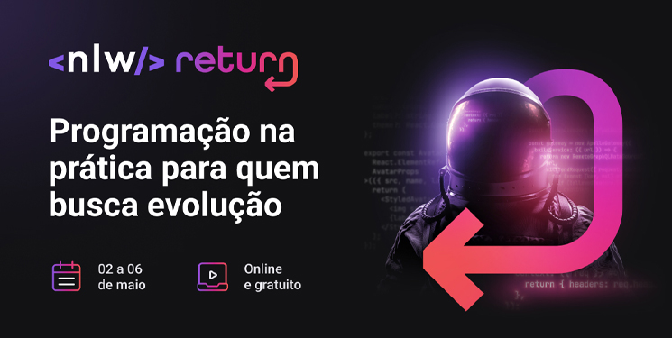

<h1 align="center">
  
  
Rocketseat - NLW Return  
  Trilha Origin 🚀
  

</h1>

<h2>Sobre o projeto</h2>

 Durante 5 dias o <strong>Educador Mayk Brito</strong> ensinou a construir uma aplicação completa e inédita em uma missão repleta de código e muito aprendizado, chamada <strong>DoctorCare.</strong>

Foi ensinado Fundamentos web, Algoritmos, Lógica de Programação, DOM, HTML, CSS e JavaScript.

<h2>O que eu aprendi ?</h2>

No ínicio eu já sabia o básico, aprendi muita coisa em 5 dias, coisas que nunca tinha visto como a acessibilidade com a medida rem e o porque utilizar, o porque do uso de SVG, muitas coisas em HTML, CSS e JavaScript que nunca havia visto. Muito grato por todo ensinamento do Mayk Brito e da Rocketseat que proporcionol este maravilhoso evento

<h2>Tecnologias utilizadas</h2>

- HTML
- CSS
- JavaScript
